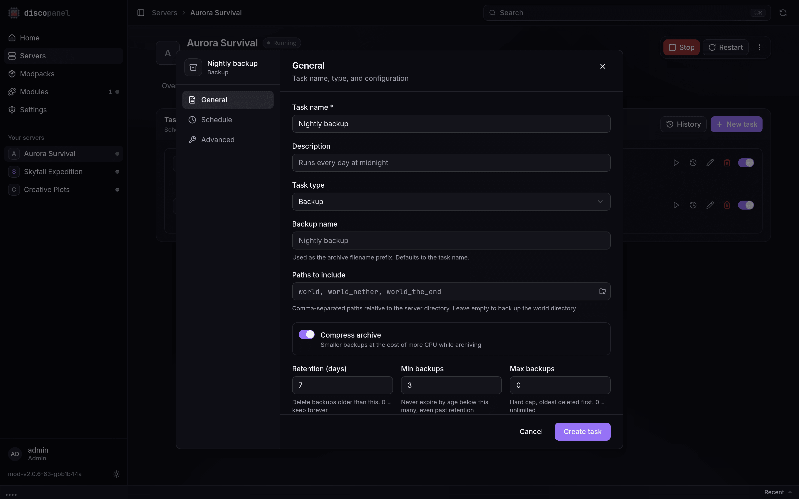
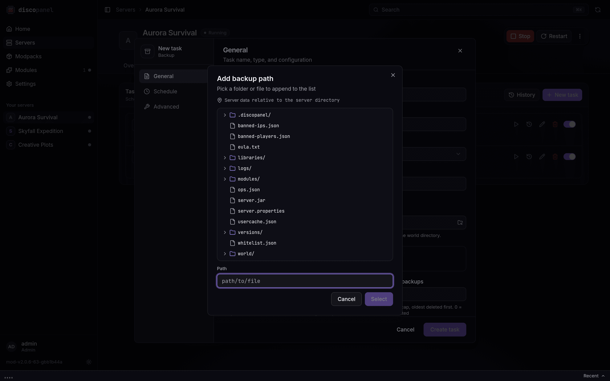

import { Aside } from '@astrojs/starlight/components';

DiscoPanel has built-in server backups via the **Backup** task type. Backups run on a schedule (or on demand), safely archive your world data while the server is running, and clean up old backups automatically based on the retention rules you set.

## Creating a backup task

1. Open your server and go to the **Tasks** tab.
2. Click **New Task** and select the **Backup** task type.
3. Configure what to back up and how long to keep backups (see below).
4. Pick a schedule - a cron expression (e.g. `0 0 * * *` for daily at midnight), a fixed interval, or a one-time run.
5. Create the task. You can also trigger it immediately with the **Run Now** button.



Every run is recorded in the task's execution history, including the archive name, file count, size, duration, and how many old backups were pruned.

## What gets backed up

By default (with **Paths to Include** left empty), DiscoPanel backs up the server's **world directory**. On Paper, Spigot, and other Bukkit-based servers, the separate `world_nether` and `world_the_end` dimension folders are included automatically. On vanilla and Forge/Fabric servers, the nether and end already live inside the world folder, so they're covered either way.

To back up more than the world - or a custom layout - list paths explicitly, comma-separated and relative to the server directory:

```
world, world_nether, world_the_end, server.properties, config
```

The folder button next to the field browses the server's files and appends whatever you pick:



Paths that don't exist yet (for example, a dimension that hasn't generated) are skipped and noted in the task output rather than failing the backup.

<Aside type="note">
If the server is running, DiscoPanel pauses world saving (`save-off`), flushes pending writes to disk (`save-all flush`), creates the archive, and then re-enables saving (`save-on`) - so the backup is consistent and your server keeps running. Servers that are offline can be backed up too. Just disable **Require Server Online** in the task's Advanced section.
</Aside>

## Backup options

| Option | What it does |
|---|---|
| **Backup Name** | Filename prefix for the archives. Defaults to the task name. |
| **Paths to Include** | Comma-separated paths relative to the server directory. Empty = world directory. |
| **Compress Archive** | Compresses archive contents. Disable for faster backups that use more disk. |
| **Retention (days)** | Backups older than this are deleted after each run. `0` = keep forever. |
| **Min Backups** | Age-based expiry never reduces the backup count below this. The most recent backup is always kept. |
| **Max Backups** | Hard cap on the number of backups, oldest deleted first. `0` = unlimited. Takes precedence over Min Backups. |

The retention rules combine like this: **Retention (days)** expires old backups, **Min Backups** stops that expiry from leaving you with too few (useful for servers that back up rarely or sit idle), and **Max Backups** is an absolute ceiling on disk usage.

Retention is scoped to the task's backup name, so multiple backup tasks for the same server (e.g. an hourly world backup and a weekly full backup) never prune each other's archives.

## Where backups are stored

Backups are written as `.zip` files to DiscoPanel's backup directory, grouped per server:

```
<backup_dir>/<server_folder>/<backup_name>_<timestamp>.zip
```

The backup directory is set by `storage.backup_dir` in `config.yaml` (default `./backups`), or the `DISCOPANEL_STORAGE_BACKUP_DIR` environment variable. If you run DiscoPanel in Docker, make sure it's mounted as a volume so backups survive container recreation:

```yaml
volumes:
  - ./backups:/app/backups
```

<Aside type="caution">
Keep your backup directory on different storage than your server data if you can - a backup on the same failing disk isn't much of a backup.
</Aside>

## Restoring a backup

1. **Stop the server.**
2. Locate the backup `.zip` in your backup directory on the host.
3. In the server's **Files** tab, delete (or rename) the world folder(s) you're restoring, then upload the backup archive and extract it. Alternatively, extract it directly into the server's data directory on the host.
4. Start the server.

<Aside type="note">
Backups created with default settings contain the world folder(s) at the archive root, so extracting into the server directory puts everything back where it belongs.
</Aside>
