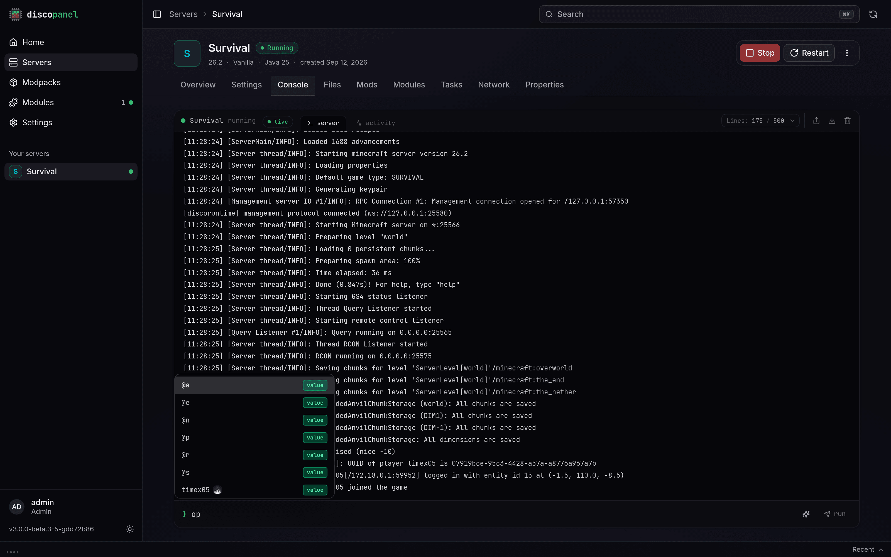

The **Console** tab gives you live, real-time control over your running Minecraft server directly from the browser. You can monitor server logs as they are printed, run server commands with intelligent autocompletion, and switch to the activity log to inspect system actions.

## Interactive Command Autocomplete

DiscoPanel includes a real-time **Command Completion** engine built directly into the console. As you type a command in the input box, DiscoPanel predicts available commands, arguments, static values, and online player names.

### Engine Support

Command completion works automatically across all major Minecraft server software types:

- **Paper, Purpur, Folia**: Powered by native server command node trees.
- **Vanilla, Fabric, Quilt, Forge, NeoForge**: Full prediction support for Minecraft **1.13 and newer** powered by DiscoPanel's built-in Vanilla completion engine.

:::note
For Vanilla-like server loaders running Minecraft versions older than 1.13, command predictions are automatically disabled as those versions help output differs from newer versions.
:::

### Completion Types & Badges

When the prediction overlay appears above the input box, suggestions are tagged with visual badges:

| Badge | Type | Description |
| :--- | :--- | :--- |
| `cmd` | Command / Subcommand | Top-level commands (e.g. `/op`, `/tp`, `/gamerule`) or subcommands. |
| `arg` | Argument | Variable argument position expected by the command schema. |
| `value` | Value | Predefined literal choices (e.g., boolean `true`/`false`, game modes). |
| `opt` | Optional | Indicates that the argument is optional in the command signature. |

### Shortcuts & Controls

- <kbd>Tab</kbd>: Selects the highlighted completion token or completes the top suggestion.
- <kbd>↑</kbd> / <kbd>↓</kbd>: Navigates up and down through the list of suggestions.
- <kbd>Enter</kbd>: Executes the entered command.
- <kbd>Esc</kbd>: Closes the suggestion overlay.

### Command History

When the autocompletion overlay is hidden, pressing <kbd>↑</kbd> and <kbd>↓</kbd> cycles through your previously executed command history.

### Toggling Autocomplete

Command completion can be toggled on or off at any time by clicking the **Sparkles** (<kbd>✨</kbd>) icon on the right side of the console input field. Your preference is automatically saved in browser storage.

---

## Console Channels

The console features two distinct channels at the top:

1. **Server (`server`)**: Streams live container log output, server events, and command outputs over WebSocket.
2. **Activity (`activity`)**: Displays structured logs of actions performed on the server by DiscoPanel automation (such as Auto-Pause, Auto-Stop, Crash Doctor fixes, scheduled backups, or mod preflight checks).

### Log Controls

- **Tail Lines**: Use the selector dropdown to pull the last 100, 500, 1000, or 2000 log lines.
- **Pause & Auto-scroll**: Scrolling up inside the log view pauses automatic scrolling so you can inspect past logs. A bottom anchor button appears to quickly resume pinned auto-scrolling.
- **Share & Clear**: Upload logs to [mclo.gs](https://mclo.gs) with a single click or clear stored logs.
