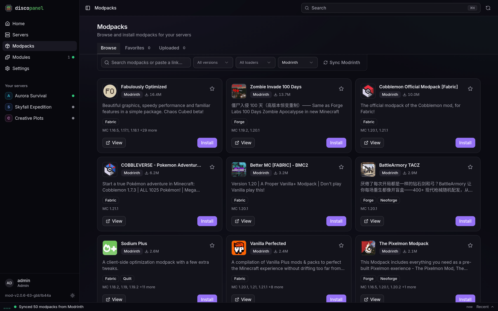

DiscoPanel installs modpacks for you. Pick a pack and the panel downloads it, installs the right mod loader, and sets everything up before the server starts. You can watch it happen in the server console.

## Installing a pack

The easiest way is the **Modpacks** page. Search CurseForge or Modrinth, pick a pack (and optionally a specific version), then create a server from it. The Minecraft version, mod loader, and recommended memory are filled in for you.

You can also point an existing server at a pack from its properties tab:

- **CurseForge**: paste the pack's page URL into **CurseForge Page URL**. To lock it to a specific file, use a URL ending in `/files/<id>` or fill in **CurseForge File ID**.
- **Modrinth**: put the pack's name or URL in **Modrinth Modpack**. Lock a version with **Modrinth Version**.
- **Your own zip**: upload it on the Modpacks page. Client exports and server packs both work.

:::note
CurseForge requires an API key for downloads. Get a free one at [console.curseforge.com](https://console.curseforge.com/#/api-keys) and paste it into DiscoPanel's global settings.
:::

## Updating a pack

Packs never update behind your back. Restarting a server keeps whatever version is installed.

- If you pinned a version, change the pin and restart to move to it.
- If you didn't, turn on **Force Re-Provision** in the server properties and restart. The newest version gets installed and the switch turns itself back off.

Config files you've edited and mods you've added yourself are left alone during updates.

## Mods that need a manual download

Some CurseForge authors don't allow their mods to be downloaded automatically. When a pack includes one, the install stops with a message listing each mod and a link to its download page. Download those files in your browser, upload them to the server's `mods` folder, and start the server again. The install picks up where it left off.

## Adding individual mods

Upload jars in the Mods tab whenever you like. DiscoPanel won't touch them.

If you'd rather have DiscoPanel fetch mods for you, list them in the **Modrinth Projects** field (names or IDs, separated by commas). They get installed to match your server's loader and Minecraft version, and **Modrinth Download Dependencies** can pull in whatever they depend on.
