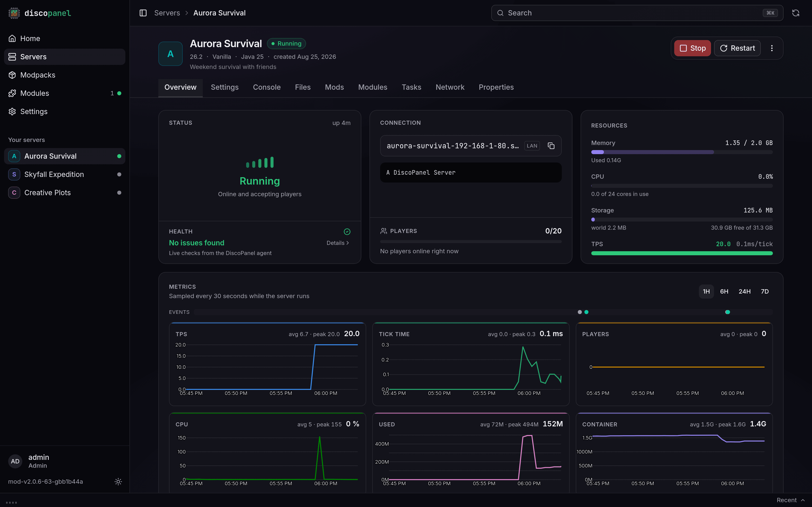
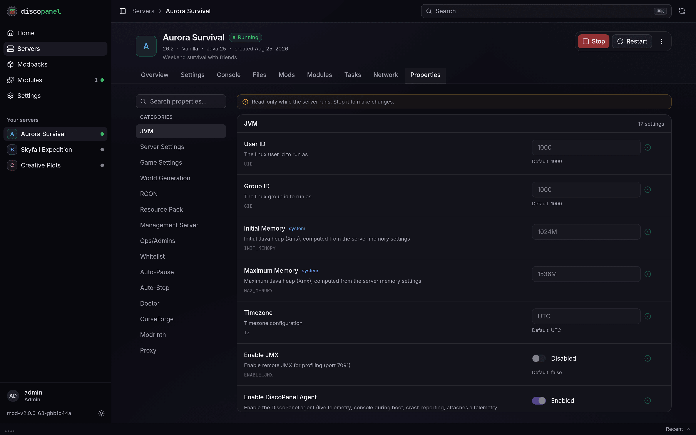

## The health check

Every server's dashboard has a **Health** section at the bottom of its Server Status card. At a glance it tells you whether DiscoPanel found anything slowing your server down, like "CPU throttling detected" or "Heap exceeds the container memory limit". Click it for the full list of findings in plain language. When a finding has an obvious remedy, there's a button right next to it that applies the fix for you. Fixes take effect the next time the server starts.

While the server is stopped, the health check covers what it can tell from your settings alone. Start the server and the live measurements join in: tick timing, garbage collector pauses, CPU throttling, memory and disk pressure straight from the kernel (which warns *before* an out-of-memory kill, not after), and any recent crash (with a pointer to the crash report in the Files tab).

"No issues found" doesn't mean your server is fast, it means DiscoPanel found nothing holding it back. A modpack can still be heavy on its own.

## Memory

Give a server its memory when you create it (you can change it later in Settings). DiscoPanel splits it between Java and the overhead the server process needs, so the number you pick is the total the server gets. If you're not sure, 4 GB is fine for vanilla and small plugin servers, and 6 to 10 GB for modpacks.

More isn't always better. Java's garbage collector works harder with a huge amount of memory, so don't hand a server 20 GB just because it's available.

**Automatic Memory** (in the properties tab) sizes the Java heap from the server's memory for you, so the two can never disagree. It's the fix the health check offers when your heap and your memory limit don't fit each other. If you manage the heap yourself and it doesn't fit, DiscoPanel clamps it for that start so the server isn't killed mid-game, and says so in the console.

## Garbage collector tuning is on by default

**Use Aikar Flags** enables the garbage collector tuning that most serious Minecraft servers run. It reduces lag spikes, especially on busy or modded servers, and it's safe for everything, so DiscoPanel applies it by default. Untick the checkbox if you really want stock JVM behavior.

**Use MeowIce Flags** is a newer, more aggressive set for modern Java versions. Enabling it takes the place of the default Aikar set.

**Use ZGC Flags** switches to a different garbage collector entirely (generational ZGC, Java 21 or newer) whose pauses are too short for players to feel. For big modpacks with 12 GB of memory or more it usually beats the other two, and the health check suggests it when your server fits that picture.

Pick one of the three, not a combination.

## Where the numbers come from

Every server runs with a small DiscoPanel agent alongside it, on by default. It's what feeds the health check and the dashboard: tick speed, memory, CPU, who's online, plus crash detection and a console that accepts commands even while the server is still booting. It works the same on every server type and version, vanilla included, doesn't touch your mods or plugins folders, and has no gameplay footprint.

If you ever need to, untick **Enable DiscoPanel Agent** in the properties tab. Everything keeps working, DiscoPanel just falls back to slower measuring (server pings), and boot-time console commands and live tick timing go away.

## Performance history

The overview tab charts how your server has been doing: tick speed, tick time, players online, CPU, and memory. While the server runs, a point is recorded every 30 seconds and the charts update live. Use the range buttons (1H to 7D) to zoom out, great for answering "was it lagging while I was at school?" Older history is kept for 30 days in a compressed form, and it costs nothing to leave on.

## Why restarts are fast

DiscoPanel installs a server's files once, up front. After that, starting the server is nothing but Java starting up, so restarts take seconds instead of sitting through downloads and install scripts. On Java 19 and newer, the server also keeps a class cache between runs (rebuilt automatically whenever mods or the Java version change), which trims startup a little more every time.

## Quietly working in the background

A few performance defaults apply to every server with nothing to configure: the server's tick thread gets scheduling priority over garbage collection, world saving, and other containers, so lag sources yield to gameplay under load; server containers outrank background containers (like map renderers) when they compete for CPU; huge memory pages are used for the heap whenever the host allows it; and Java 25 servers pack objects into less memory with compact object headers. If the host has a setting worth changing, the health check will tell you rather than making you go looking.

## For the tinkerers

The properties tab has fields for raw JVM options (**JVM Options**, **JVM XX Options**, **JVM DD Options**) and for arguments passed to the server itself (**Extra Arguments**). There are also switches for SIMD optimizations, the Flare profiler, and remote JMX. If none of that means anything to you, you're not missing out.

Server settings also offer a **GraalVM** runtime image (Java 21 and 25). It swaps the standard Java for Oracle's GraalVM, whose newer compiler often runs modded servers a bit faster. Results vary by pack, so try it on your server and keep whichever feels better; switching back is the same dropdown.
