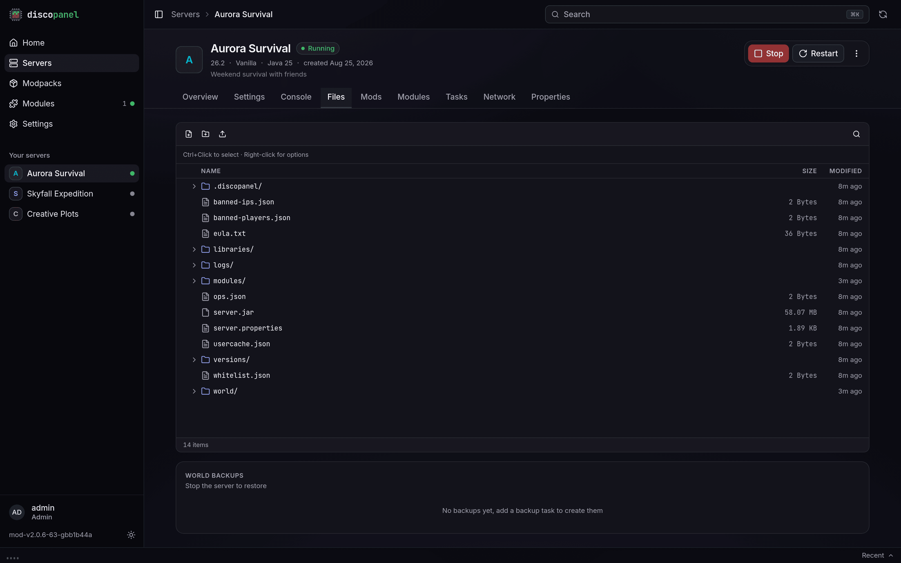

Every server gets its own folder, browsable from the Files tab. Worlds, mods, configs, logs, it's all in there.

## What you can edit freely

Worlds, the `mods` and `plugins` folders, mod configs under `config`, datapacks, resource packs. DiscoPanel never deletes or overwrites files it didn't put there.

## What DiscoPanel manages

A few files are generated from your panel settings every time the server starts:

- `server.properties`
- `eula.txt`
- `ops.json` and `whitelist.json`
- `server-icon.png`

Change these through the server's Properties tab instead of the file editor, because hand edits to them get overwritten on the next start. Entries in `server.properties` that the panel doesn't manage are kept, and you can add your own through the **Custom Server Properties** field.

## The .discopanel folder

Each server folder contains a `.discopanel` folder where DiscoPanel keeps track of what it has installed. Leave it alone. If it goes missing, the server software gets reinstalled on the next start. Your world and mods would be safe, it just re-downloads things it already had.

## Starting fresh

**Force Re-Provision** in the properties tab reinstalls the server software and modpack on the next start without touching your world, your configs, or the mods you added. It's the fix for a broken install or a pack that won't update.
