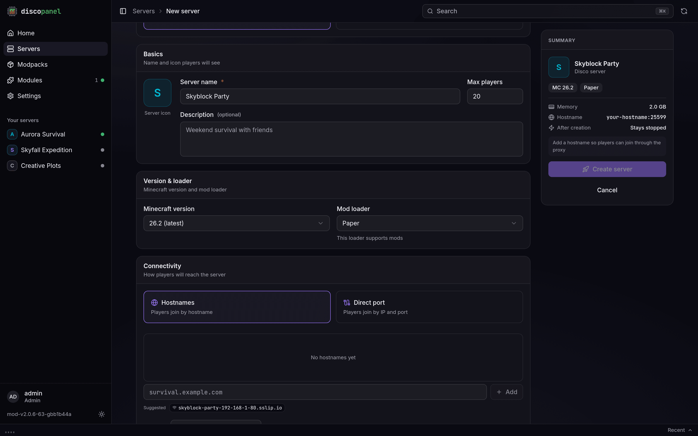

When you create a server you choose the software it runs. For most types, DiscoPanel downloads and installs everything for you. There is nothing to set up on your machine.

## Installed automatically

- **Vanilla** - the official Mojang server
- **Paper, Purpur, Folia** - high performance servers with plugin support
- **Fabric and Quilt** - lightweight mod loaders
- **Forge and NeoForge** - the classic mod loaders

DiscoPanel picks the recommended build for your Minecraft version, or the latest stable one if there's no recommendation. If you need a specific Forge or NeoForge build, set the **Forge Version** field in the server properties.

The **Auto CurseForge** and **Modrinth** types install a modpack instead, and the pack decides which loader to use. See [Modpacks](/guides/modpacks/).

## Everything else

Server software that DiscoPanel can't download for you (Spigot, hybrid servers like Mohist, or something homemade) still works fine. Upload your server files through the Files tab, then either:

- set **Custom Server JAR** to the jar's location (a path inside the server folder, or a URL for DiscoPanel to download), or
- set **Custom JAR Execution** if the server needs its own launch arguments, for example `-jar mohist-1.20.1.jar`.

Memory and JVM settings apply to custom servers like any other.

:::note
Spigot's license doesn't allow anyone to distribute prebuilt jars, so no panel can install it automatically. Paper is a faster drop-in replacement that DiscoPanel installs for you. If you really need Spigot, build it with BuildTools and upload it as a custom jar.
:::

## Java versions

You never need to think about Java. DiscoPanel checks which Java version your Minecraft version needs and uses it. If you want to force a different one anyway, there's an override under **Advanced** when creating or editing a server.
