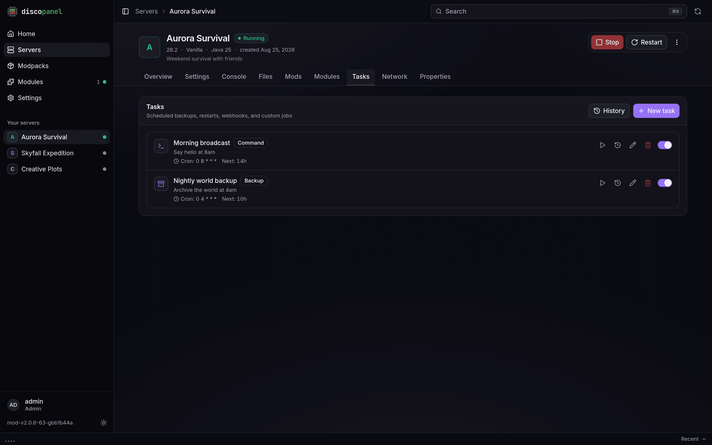

Every server has a **Tasks** tab where you can automate things. A task is one action plus a rule for when it runs.



## What a task can do

| Type | What it does |
|---|---|
| **Command** | Runs a console command on the server (say, `weather clear` or a nightly `broadcast`) |
| **Backup** | Archives your world - see the [Server Backups guide](/guides/backups/) |
| **Restart / Start / Stop** | Exactly what they sound like |
| **Webhook** | Sends a message to another service, like a Discord channel |
| **Script** | Runs a program inside the server's container (advanced, most people never need this) |

## When it runs

Pick one of four schedules when creating the task:

- **Cron** - a schedule expression like `0 6 * * *` (every day at 6:00). Great for "restart every morning".
- **Interval** - every N minutes/hours.
- **Once** - at a specific date and time.
- **On event** - the moment something happens: server starts, stops, restarts, becomes healthy, or a player joins, leaves, dies, earns an advancement, or sends a chat message.

Player events (join, leave, death, advancement, chat) are reported by the DiscoPanel runtime that lives inside every server DiscoPanel creates. Servers running a custom image without that runtime still get the server events, but the player ones will not fire - the same goes for the per-player RCON commands in server settings.

Any task can also be fired by hand with **Run Now**. Every run is recorded in the task's history with its output, so you can see what happened and when.

Path fields - the script path, a backup's include paths - have a folder button that browses the server's files, so you pick the path instead of typing it from memory.

By default most tasks are skipped when the server is offline (there's a **Require Server Online** switch in the task's advanced options). Webhooks are the exception - they always fire, because "the server stopped" is exactly the kind of thing you want to be told about.

## Discord notifications

The classic setup: a message in your Discord when someone joins.

1. In your Discord server: **Server Settings > Integrations > Webhooks > New Webhook**, pick a channel, copy the webhook URL.
2. In DiscoPanel: create a task, type **Webhook**, schedule **On event**, and tick the events you care about (say, player join and leave).
3. Paste the Discord URL as the webhook URL, and set the payload template to something like:

```
{"content": "**{{.Server.Name}}**: {{.Event}}{{if .Data.player}} - {{.Data.player}}{{end}}"}
```

That posts messages like **My Server**: player_join - Steve. Leave the template empty to send the full details as JSON instead (which is what most non-Discord services want).

Death, advancement and chat events also carry `{{.Data.detail}}` - the death message, the advancement title, or the chat line - so a death feed for your Discord is one webhook task away.

## For developers on the receiving end

Webhook requests are `POST`s with a JSON body. The default payload includes the event name, a timestamp, and a server snapshot (name, status, version, player count). Useful headers:

- `X-DiscoPanel-Event` - the event name (`server_start`, `server_stop`, `server_restart`, `server_healthy`, `player_join`, `player_leave`, `player_death`, `player_advancement`, `player_chat`, or `manual`)
- `X-DiscoPanel-Signature` - `sha256=<HMAC hex>` of the body, if you set a secret on the task. Verify it to know the request really came from your panel

Failed deliveries are retried with increasing delays, and the response is captured in the task history either way.
