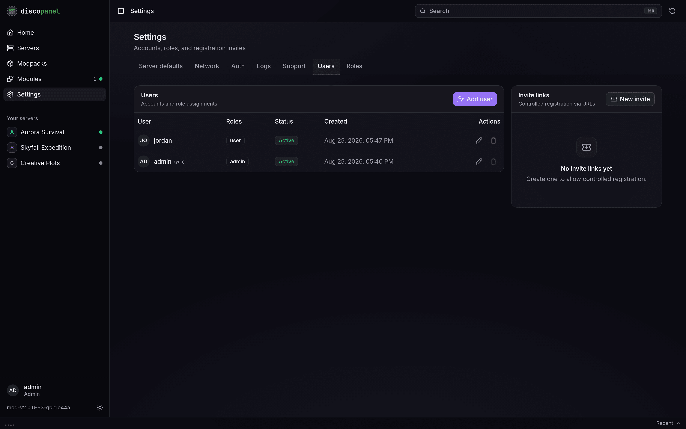
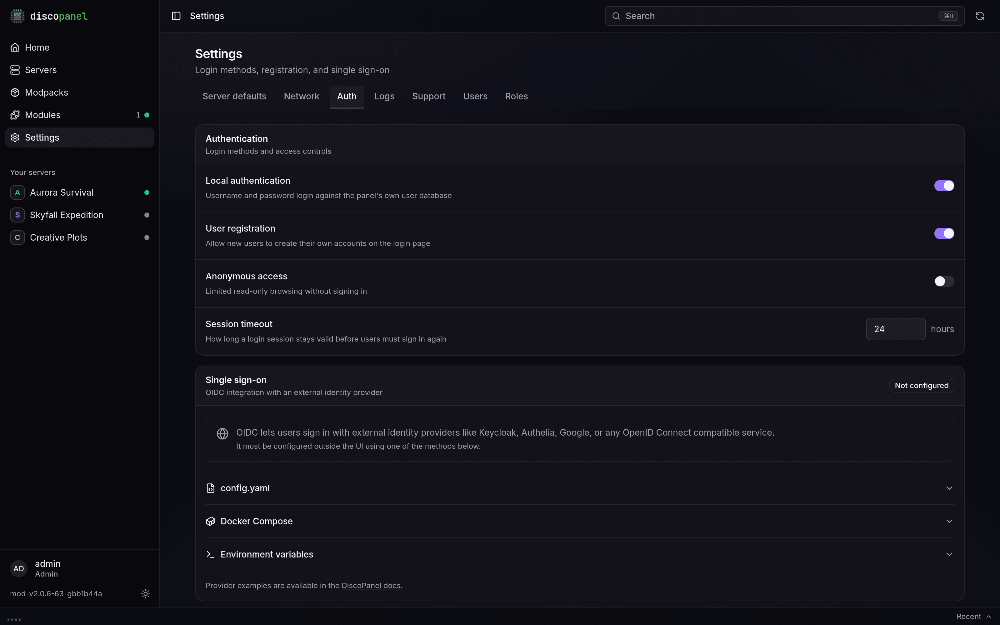
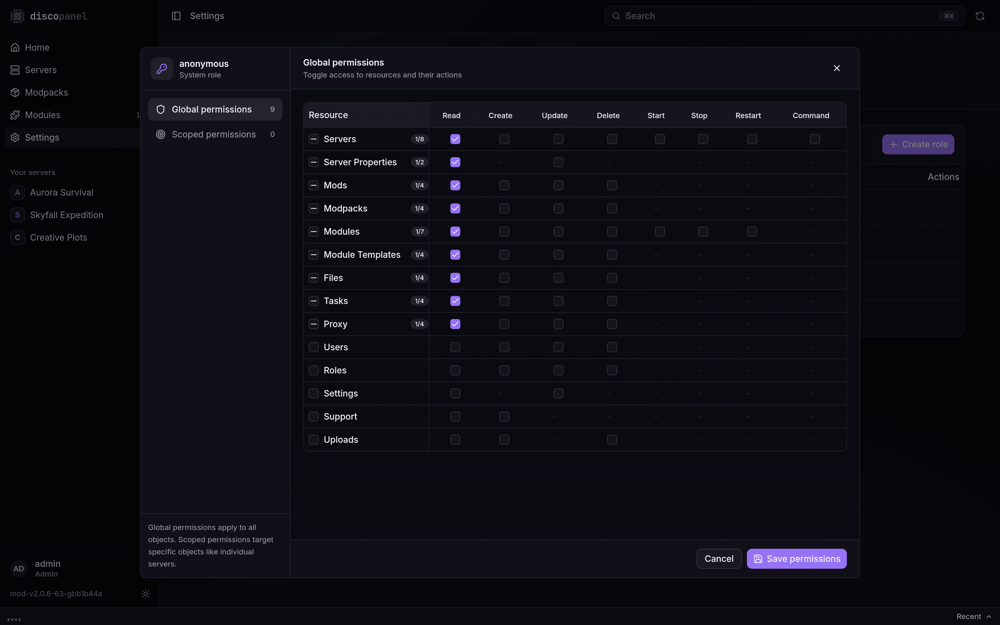

DiscoPanel is multi-user. Accounts live in **Settings > Users**, permissions in **Settings > Roles**. The first account created on a fresh panel is the admin; everyone after that gets whatever roles you hand out.

## The roles that ship with the panel

| Role | What it can do |
|---|---|
| `admin` | Everything. Can't be edited or deleted. |
| `user` | Browse servers, files, tasks, modules and modpacks; start, stop and restart servers; send console commands. Can't create, change or delete anything, and can't see users, roles or settings. New accounts get this role by default. |
| `anonymous` | The same browsing, minus start/stop and commands. Only matters if you enable anonymous access in Settings > Auth. |
| `module`, `doctor`, `bot` | Internal roles for module containers. Leave them alone. |

A user can hold several roles; anything any of their roles allows is allowed.

## Adding people

Two ways:

- **Add user** in Settings > Users: pick a username, a password, and roles. Users change their own password later on their Profile page.
- **Invite links**: create an invite with preset roles, an expiry, a use limit, and an optional PIN. The link is copied to your clipboard when you create it. Invites work even when open registration is off, which makes them the nicest way to let friends in.

Open self-registration is a switch in **Settings > Auth** (off by default). Self-registered users get every role marked as a default role - out of the box, just `user`.

There is no admin password reset. If someone loses their password, make them a new account, or use the recovery key (below).

## Custom roles

Create a role in **Settings > Roles**, then click **Edit** in its Permissions column.

The editor has two sections:

- **Global permissions** - a grid of resources (servers, files, tasks, modules, ...) against actions (read, create, update, delete, start, stop, restart, command). A checked cell applies everywhere.
- **Scoped permissions** - the same actions granted on individual objects. This is how you make a role that can only manage one server: grant its actions on that server alone.

One thing to know about scoped-only roles: the server list itself is a global read. A role that can only see one specific server still needs global `servers: read` to have the list render, and it will see the other servers' names there. Scoped grants control what they can do, not what the list shows.

Mark a custom role as a **default role** and every new signup gets it automatically.

## Logging in with OIDC

The panel can map groups from your identity provider onto these same roles at login, so a member of your `admin` group is a DiscoPanel admin without anyone touching the Users tab. See the [OIDC guides](/guides/oidc/keycloak/).

## API tokens

Any user can mint personal API tokens on their **Profile** page for scripts and integrations. A token acts as its owner: same roles, same limits, revoked the moment the account is deactivated. The token value is shown once, on creation, with a ready-made curl line.

## Locked out?

Every start, the panel writes a recovery key to `recovery.key` in its data directory (and prints it to the log). The **Recovery** link on the login page accepts it - and resets the panel to first-user setup, wiping all accounts, sessions, tokens and invites. Servers and their data are untouched. It's the fire axe, not the spare key.
