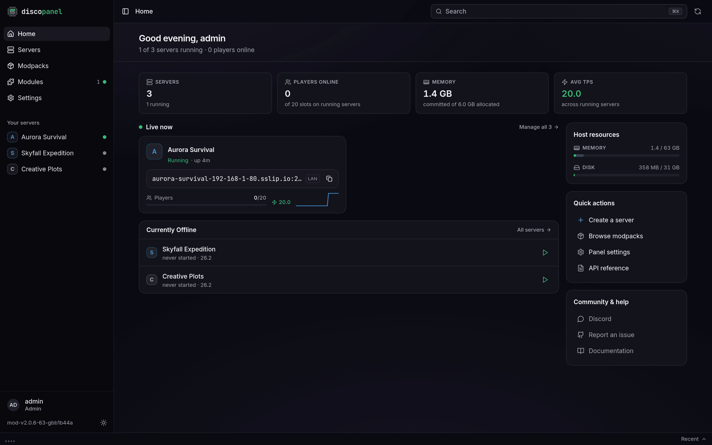

DiscoPanel is a self-hosted Minecraft server manager. You run it on your own machine, open it in a browser, and it takes care of the rest: it downloads the server software, installs modpacks, starts and stops everything, and keeps it all organized - each server safely in its own Docker container.

Things it does for you:

- **Installs everything.** Vanilla, Paper, Fabric, Forge, NeoForge and more - plus full CurseForge, Modrinth and FTB modpacks. No manual downloads, no Java to install. See [Server Software](/guides/server-software/) and [Modpacks](/guides/modpacks/).
- **One address per server.** With the built-in [proxy](/guides/proxy/), all your servers share a single port and players connect to names like `survival.mc.example.com`. An optional [lobby](/guides/lobby/) lets players pick a server by walking through a portal.
- **Saves resources.** Empty servers can [go to sleep](/guides/autopause/) and wake automatically when someone joins.
- **Keeps your worlds safe.** Scheduled [backups](/guides/backups/) with retention rules, and [tasks](/guides/tasks/) for restarts, commands, and Discord notifications.
- **Grows with you.** [Modules](/guides/modules/) add Bedrock crossplay (phones and consoles), a 3D web map, a Discord bot, and more. [Multi-user access](/guides/users/) with roles and optional [OIDC login](/guides/oidc/keycloak/).

To get going, pick an install method - [Docker Compose](/getting-started/docker-compose/) is the recommended one - then open the panel, create your admin account, and make your first server.

For the full feature list, see the [project README](https://github.com/discohaus/discopanel).
