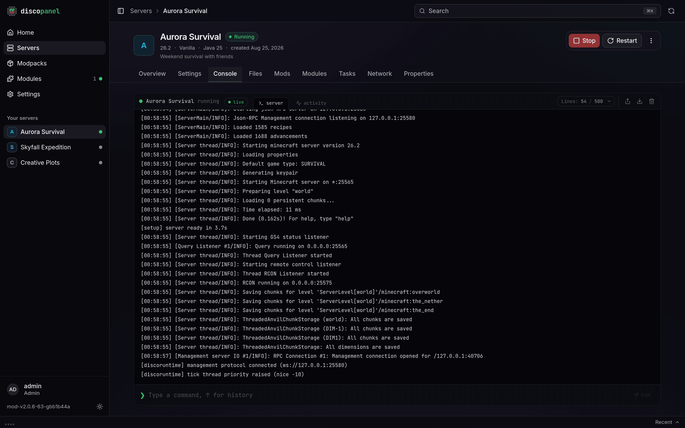

## What the status badges mean

| Badge | What's happening |
|---|---|
| **Provisioning** | DiscoPanel is downloading and installing server files. Watch progress in the Console tab - the lines start with `[provision]`. Big modpacks can take a few minutes. |
| **Starting** | The server process is booting. Modded servers can take several minutes here. |
| **Running** | The server answered a ping. All good. |
| **Sleeping** | Paused by [auto-pause](/guides/autopause/). Joining wakes it. |
| **Unhealthy** | The server hasn't answered pings for a while. It might still be playable - see below. |
| **Error** | The last start failed. The Console tab has the reason. |

## Stuck on Provisioning, or the start failed

Open the **Console** tab and read the last few `[provision]` lines. The usual causes:

- **"the Minecraft EULA must be accepted"** - turn on **Accept EULA** in the server properties.
- **A CurseForge API key error** - CurseForge packs need an API key. See the [Modpacks guide](/guides/modpacks/). New keys sometimes take a day or two to start working.
- **A list of mods with download links** - those mods must be downloaded manually. The [Modpacks guide](/guides/modpacks/#mods-that-need-a-manual-download) walks through it.
- **Download or DNS errors** - usually your network, a firewall, or the upstream service (CurseForge, Modrinth, Mojang) having a moment. Try again later.

## The server says Unhealthy

Unhealthy means "not answering pings", not "down". Some mods block status pings, and a heavily lagging server can miss them too. Try joining anyway, and try the Console - commands still work on an unhealthy server. If it never becomes healthy and you can't join, check the Console tab for crash output.

## Players can't connect

Work through this list:

1. Is the server **Running** (or **Sleeping**)?
2. Using the [proxy](/guides/proxy/)? Check that your DNS wildcard points at your public IP and the proxy port is forwarded on your router.
3. Not using the proxy? Friends need your **public** IP plus the server's port, and that port forwarded on your router. People on your own WiFi use your local IP instead.
4. Modded server? Players need the same mod loader and mods installed - for CurseForge/Modrinth packs, they should install the same pack in their launcher.
5. "Invalid session" or login errors with a cracked launcher: the server's **Online Mode** setting decides whether Mojang accounts are verified.

## Permission errors (`failed_precondition`)

DiscoPanel needs to read and write its data directory, and server containers write files as user `1000:1000` by default. If you moved the data folder or run on an unusual setup, check ownership with `ls -la` and fix it with `chown`.

## Uploads failing or running out of memory

For very large files (modpack zips, world folders), copy them straight into the server's folder on the host with `scp`, SFTP, or a file manager instead of the browser. Make sure the copied files are readable and writable by DiscoPanel afterwards.

## Where the logs are

- **Panel logs**: Settings > Logs in the UI.
- **Server logs**: each server's Console tab, or `logs/latest.log` in its Files tab.
- **Install progress**: the Console tab, lines prefixed with `[provision]`.

## Reporting issues

Before opening a GitHub issue:

1. Check this page and the [FAQ](/faq/) first
2. Try the latest version of DiscoPanel
3. Include your Docker/compose version, DiscoPanel version, and relevant logs
4. Open an issue at [github.com/discohaus/discopanel/issues](https://github.com/discohaus/discopanel/issues)

For quicker help, ask in the [Discord](https://discord.gg/6Z9yKTbsrP).
